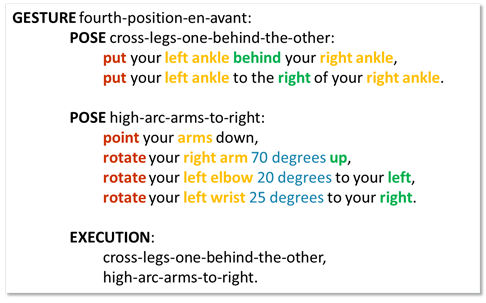

# Prepose
###A Scripting Language for Kinect v2 Gestures

With the rise of sensors such as the Microsoft Kinect, Leap Motion, and hand motion sensors in phones such as the Samsung Galaxy S5, natural user interface (NUI) has become practical. NUI raises two key challenges for the developer: first, developers must create new code to recognize new gestures, which is a time consuming process. Second, to recognize these gestures, applications must have access to depth and video of the user, raising privacy problems. We address both problems with Prepose, a novel domainspecific language (DSL) for easily building gesture recognizers, combined with a system architecture that protects user privacy against untrusted applications by running Prepose code in a trusted core, and only interacting with applications via gesture events.

Prepose lowers the cost of developing new gesture recognizers by exposing a range of primitives to developers that can capture many different gestures. Further, Prepose is designed to enable static analysis using SMT solvers, allowing the system to check security and privacy properties before running a gesture recognizer. We demonstrate that Prepose is expressive by creating novel gesture recognizers for 28 gestures in three representative domains: physical therapy, tai-chi, and ballet. We further show that matching user motions against Prepose gestures is efficient, by measuring on traces obtained from Microsoft Kinect runs.

Because of the privacy-sensitive nature of alwayson Kinect sensors, we have designed the Prepose language to be analyzable: we enable security and privacy assurance through precise static analysis. In Prepose, we employ a sound static analysis that uses an SMT solver (Z3), something that works well on Prepose but would be hardly possible for a general-purpose language. We demonstrate that static analysis of Prepose code is efficient, and investigate how analysis time scales with the complexity of gestures. Our Z3-based approach scales well in practice: safety checking is under 0.5 seconds per gesture; average validity checking time is only 188 ms; lastly, for 97% of the cases, the conflict detection time is below 5 seconds, with only one query taking longer than 15 seconds.

 

For more, please read this paper: http://research.microsoft.com/apps/pubs/default.aspx?id=232011
